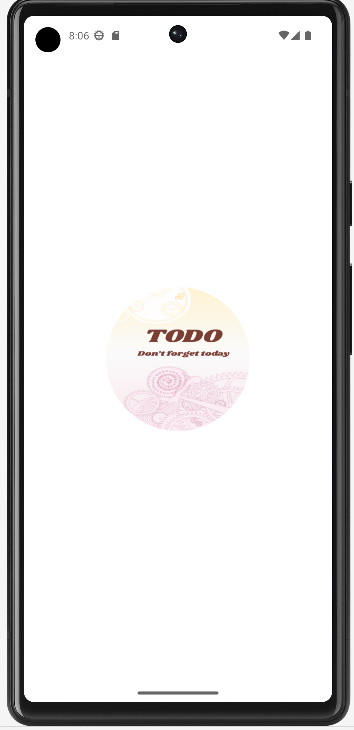
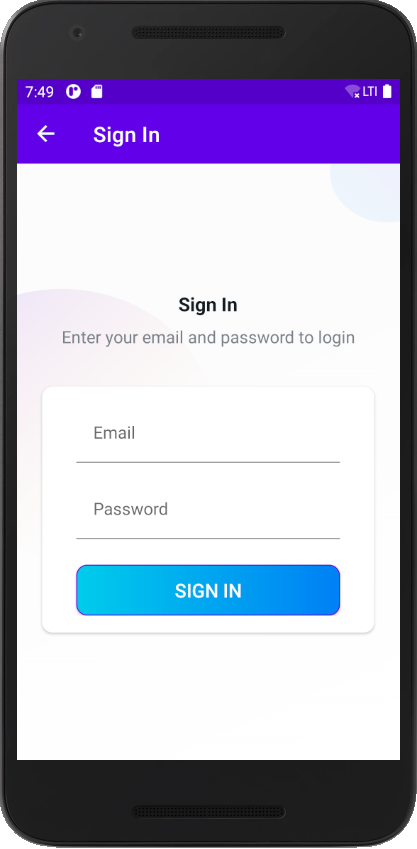
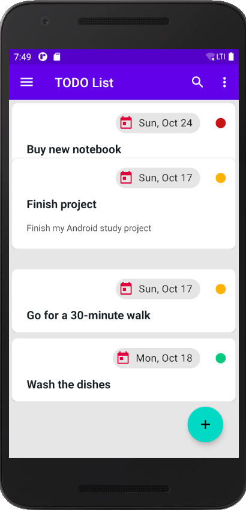
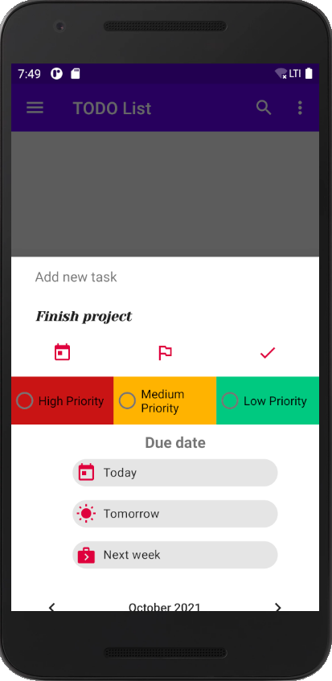

Android проект TODOApp для создания заметок с использованием библиотеки AndroidX Jetpack 
========================================================================================

Данный проект построен на основе обучающего курса Udemy -[To-Do App & Clean Architecture -Android Development - Kotlin](https://www.udemy.com/course/to-do-app-clean-architecture-android-development-kotlin/).  
Дополнительно к нему добавлена аутентификация пользователя с помощью FireBase Authentication, Shimmer Effect при загрузке данных из локального источника данных, оповещения с помощью WorkerManager о наличи задач на текущий день, выбор даты выполнения задачи и BottomSheetDialog для создания новой задачи.

## Что использовано в проекте  

Проект написан на языке Kotlin и построен с помощью современной библиотеки AndroidX Jetpack с использованием:

FireBase Authentication | FireBase Storage | FireStore | WorkerManager| ROOM Database | Dependency Injection - Dagger-Hilt | Kotlin Coroutines | Navigation Component | DataStore Preferences | ViewModel | Data Binding | LiveData | Flow | DiffUtil | RecyclerView | Material Components | ShimmerLayout | Contextual Action Mode | Modal Bottom Sheet и др...

## Дальнейшее развитие проекта

На данный момент планируется завершить написание тестов для проекта, текущие тесты проекта на данный момент не актуальны, т.к. не обновлены в соответствии с развитием проекта.

## Внешний вид проекта

   
