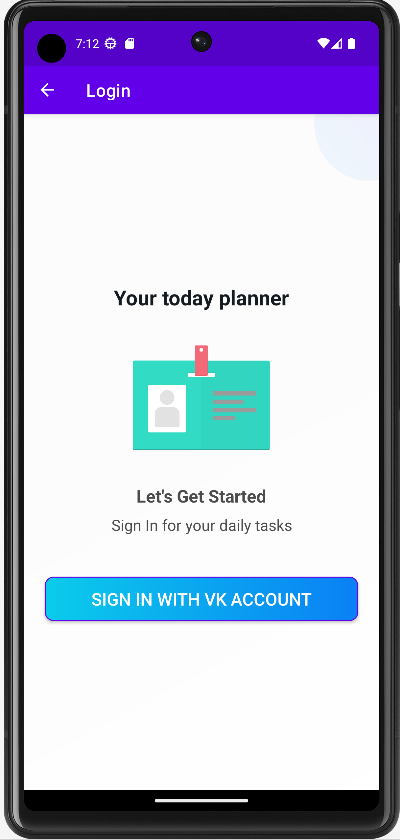
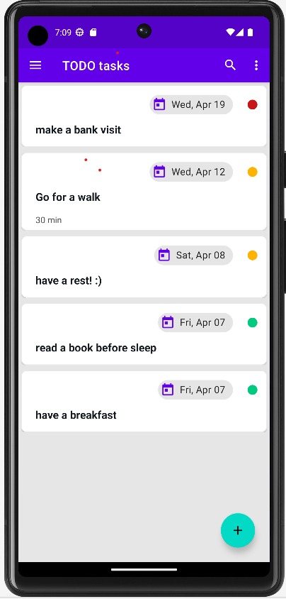
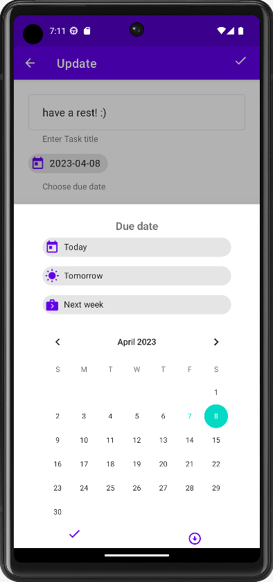

Android проект TODOApp для создания заметок
========================================================================================

# Todo App

Todo App - это приложение, которое позволяет пользователям создавать список задач, которые нужно выполнить. 
Приложение имеет архитектуру MVVM. UI представлен через Views и ViewGroups с использованием view и data binding, UI-state представлен в ViewModel через Kotlin Flows.
В качестве DI-фреймворка используется Dagger2. Для навигации используется Navigation Component. 
Уведомления пользователя о текущих задачах реализовано через WorkManager.

## Основные экраны приложения

TodoApp включает в себя следующие экраны:

### Главный экран

Главный экран содержит список задач пользователя. Каждая задача состоит из названия, описания, даты, приоритета. Пользователь может добавлять новые задачи, редактировать и удалять существующие задачи (все или несколько), сортировать по дате и приоритету.
Список задач предстален через RecyclerView с использованием DiffUtil и ShimmerLayout для отображения загрузки данных из персистентого хранилища (БД Room).
Возможно удаление нсекольких задач через Contextual Action Mode.

### Экран логина

Аутентификация через VK-аккаунт, для проверки токена используется http-вызов через Retrofit. Данные о логине (идентификатор пользователя, токен и статус логина хранятся в Preferences DataStore)

### Экран добавления/редактирования задачи

Экран добавления/редактирования задачи позволяет пользователю добавить новую/отредактировать текущую задачу. Он содержит поля для ввода названия, описания задачи, выбора даты в календаре, выбора приоритета, а также кнопку для сохранения задачи.
Календарь реализован в BottomSheetDialogFragment.

### Экран редактирования профиля пользователя

Экран редактирования профиля пользователя позволяет отредактировать общую инофрмацию о текущем авторизованном пользователе (выбрать фото, ввести email, имя).
Загрузка фото происходит с помощью Glide. 

## Внешний вид проекта

   
