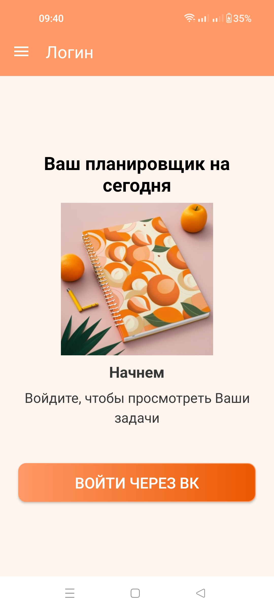

Android проект TODOApp для создания заметок
========================================================================================

# Todo App

Todo App - это приложение, которое позволяет пользователям создавать список задач, которые нужно выполнить. 
Приложение имеет архитектуру MVVM. UI представлен через Views и ViewGroups с использованием view и data binding, UI-state представлен в ViewModel через Kotlin Flows.
В качестве DI-фреймворка используется Dagger2. Для навигации используется Navigation Component. 
Уведомления пользователя о текущих задачах реализовано через WorkManager.

## Основные экраны приложения

TodoApp включает в себя следующие экраны:

### Главный экран

Главный экран содержит список задач пользователя, представленный с помощью RecyclerView с использованием DiffUtil и ShimmerLayout для отображения загрузки данных из персистентого хранилища (БД Room).

Возможно удаление нескольких задач через Contextual Action Mode.

### Экран логина

Аутентификация через VK-аккаунт, для проверки токена используется http-вызов через Retrofit. Данные о логине (идентификатор пользователя, токен и статус логина хранятся в Preferences DataStore)

### Экран добавления/редактирования задачи

### Экран редактирования профиля пользователя

Экран редактирования профиля пользователя позволяет отредактировать общую информацию о текущем авторизованном пользователе (выбрать фото, ввести email, имя).
Загрузка фото происходит с помощью Glide. 
Информация кратко дублируется в Drawer

 

